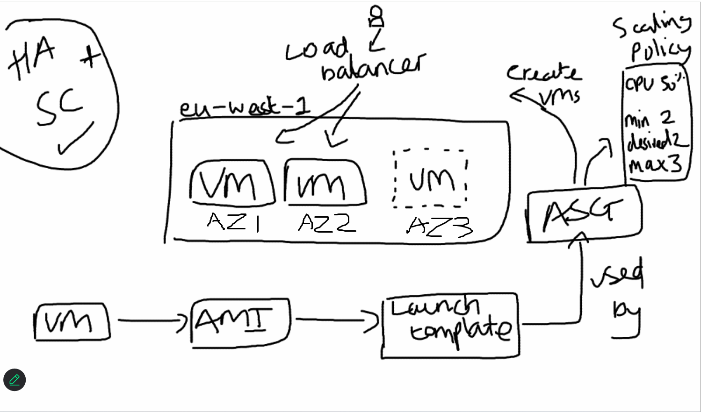

# Autoscaling
A cloud computing feature that automatically adjusts a server's capacity up or down to match the current demand.

This is **on demand**

### Web app traffic scenario
Multiple web app instances. Users are directed to them via load balancer. As more or less users try to access web app, more 'out the box' instances can be spun up or terminated as needed.
- Cloud monitoring alarms triggered as demand increases/decreases
- On trigger, increase/decrease resources (number of instances, in this case) in line with demand

### Horizontal vs vertical scaling
- **Horizontal**: more/less total instances
    - Scaling "Out" and "In"
- **Vertical**: existing instance(s) bigger/smaller
    - Scaling "Up" and "Down"

Depends on **which is more efficient in given scenario**. Most of the time, horizontal is preferred (high availability). Vertical is also vulnerable to outages (since there's only one instance).
- Horizontal is better for apps
- Vertical better for processing (data, AI...)

Real world applications will tend to be some combination of both.

If money was no object, you would just do both.

## Structure
- **VM**
- **AMI** (with **user data** - 'out the box')
- **Launch template**
    - Used by **autoscaling group (ASG)** this template so it can launch more of the same instance
- **ASG** creates more **VMs**
- **Scaling policy** determines:
    - Metric to monitor (CPU 50%)
    - Minimum VMs (2)
    - Desired VMs (2)
    - Maximum VMs (3)
- **Load balancer**
    - Sends users to VM(s) with less load, depending on demand

VMs put in different **availability zones (AZs)**, to protect against outages.

---
---
1. make launch template
    - using AMI + user data
2. make auto scaling group
    - REFER TO ASG SCREENSHOTS...
    - **delete when finished**

Removal order:
1. load balancer
2. target group
3. auto scaling group

